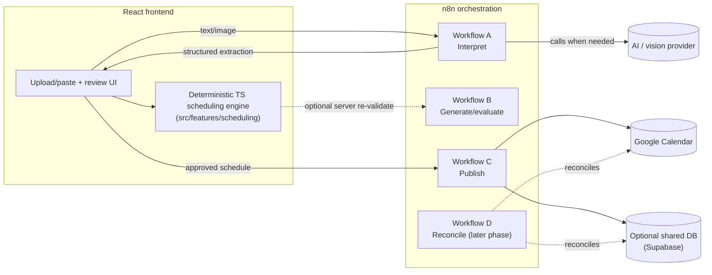

# n8n architecture

ShiftFit's frontend and deterministic scheduling engine work fully standalone
(local text parsing, manual scheduling, auto-fill, local persistence). n8n is
an **optional orchestration layer** for three things the frontend
intentionally does not do itself: calling a real AI/vision provider, talking
to Google Calendar, and coordinating retries/approvals across those external
systems. Nothing here is required to run or demo the app — every webhook has
a local fallback (see `src/services/automation/mockAutomationClient.ts` and
`src/features/import/schedule-extractor.ts`).

## Responsibility split



**Hard rule enforced by this architecture:** AI never has authority over
scheduling rules (class overlap, cutoff, lunch, 19-hour cap, max days,
opening-shift requirement). Those live only in
`src/features/scheduling/{availability,scheduler,coverage}.ts`, are unit
tested, and are the only code path allowed to produce a `ShiftBlock`.

## Automation modes

1. **Suggest only** — AI extracts, app shows recommendations, nothing is
   scheduled automatically.
2. **Draft + Review (default / current target)** — AI extracts →
   deterministic scheduler proposes a full draft → manager reviews and
   approves → only then does Workflow C publish to Google Calendar.
3. **Auto-publish (future, opt-in)** — same pipeline, but Workflow C runs
   without a manual approval step when confidence/validation thresholds pass.
   Must be an explicit opt-in setting, visually distinct from Draft + Review,
   and must still fall back to human review on low confidence, hard
   conflicts, or destructive calendar changes. **Not implemented in this
   repository** — no UI toggle exists for it yet.

## Workflow A — Intake / AI extraction

`POST /webhook/shiftfit/interpret`

Called by [`schedule-extractor.ts`](../src/features/import/schedule-extractor.ts)
only when `VITE_AUTOMATION_API_URL` is configured **and** an image is
attached. Text-only input is always parsed locally first and never leaves the
browser.

Request (multipart form — see `extractSchedule`):

| field | type | notes |
| --- | --- | --- |
| `image` | file | the screenshot, if any |
| `text` | string | pasted/typed text (max 4000 characters), treated as **untrusted data** |
| `requestId` | string | client-generated id, echoed back in the response |

The client only sends an image that is a PNG, JPEG or WebP under 5 MB, uses a 60-second timeout, and sends no cookies. Enforce the same limits again on the server.

Response body is validated client-side against
[`schemas.ts`](../src/features/import/schemas.ts) (`validateExtractedSchedule`)
before anything touches the UI:

```json
{
  "requestId": "uuid",
  "status": "needs_review",
  "confidence": 0.93,
  "meetings": [{ "day": "tue", "start": 480, "end": 555, "source": "class" }],
  "constraints": {
    "latestEnd": 960,
    "lunchStart": 720,
    "needsOpeningShift": true,
    "preference": "morning",
    "daysPerWeek": 3
  },
  "warnings": [],
  "unresolved": []
}
```

Pipeline inside n8n (implement in the workflow, not in this repo):

1. Webhook trigger, authenticate the caller.
2. Enforce request size and MIME type allow-list.
3. Treat `text` and the image as **data, not instructions** to any LLM step.
4. Deterministic parsing first where possible (you can reuse the same regex
   approach as `src/features/scheduling/parser.ts`, ported to your n8n Code
   node, or call a small shared service).
5. Vision/LLM call only for image or genuinely ambiguous text.
6. Validate the model's output against a JSON Schema mirroring
   `schemas.ts` before returning it.
7. Return the shape above. Never return raw model prose as if it were
   structured data.
8. Delete the uploaded image after extraction — do not retain it.

## Workflow B — Generate / evaluate schedule

`POST /webhook/shiftfit/generate`

The frontend already runs the exact same deterministic scheduler locally
(`src/features/scheduling/scheduler.ts`) for instant previews. This webhook
exists for a **server-side re-validation** step before publish, and for
non-browser callers (e.g., a nightly reconciliation job). If you stand this
up, it must call the identical algorithm — port `scheduler.ts` to your
backend runtime, or expose it behind a small Node/edge function and have n8n
call that function. Do not re-implement the rules inside n8n Code nodes; they
will drift from the frontend's copy.

Request: `{ students, assignments, settings }` (same shapes as
`src/features/scheduling/types.ts`).

Response: same shape as `AutoFillResult` in `types.ts`, plus a stable
`scheduleVersion` string for idempotency in Workflow C.

## Workflow C — Human approval / publish to Google Calendar

`POST /webhook/shiftfit/publish`

Called by [`n8nClient.ts`](../src/services/automation/n8nClient.ts) via
`getAutomationClient().publishSchedule(...)`, with the request built by
[`contracts.ts`](../src/services/automation/contracts.ts)'s `buildPublishRequest`.
The UI is the **Save & share** dialog (`SaveShareDialog.tsx`, section "Send to Google
Calendar"), and it enforces the approval gate itself:

- the manager must press "Approve and send" and confirm a dialog that says how many events
  for how many students will be created or updated;
- publishing is **refused while the schedule breaks a rule** (class conflict, over the weekly
  limit without an override, missing opening shift);
- the UI says ShiftFit only sends shifts and never asks the calendar to delete anything.

Request. Events are one per **contiguous shift** (adjacent half-hours are merged), and
`shiftId` is stable (`<studentId>-<day>-<startMinute>`), so a retry updates instead of
duplicating. `scheduleVersion` is a content fingerprint of who works when
(`scheduleVersion()` in `features/scheduling/blocks.ts`), so the same shifts always get the
same version, whatever their order or ids.

Each event also carries a `recurrence` block — the real first calendar date, timezone and
repeat rule for that weekly shift, computed by `buildPublishRequest` in `contracts.ts` using
the exact same date math as the `.ics` export (`countWeeklyOccurrences` /
`excludedOccurrences` in `features/calendar/ics.ts`), so the two calendar outputs can never
disagree about which date a "Monday" shift lands on. `recurrence` is only present once the
manager has saved semester dates and a timezone in **Save & share** — the "Approve and send" /
"Do a practice run" button stays locked until then, the same way the per-student `.ics`
downloads already were, because a Google Calendar event needs a real date, not just a weekday.

```json
{
  "scheduleVersion": "v6-e95b3dd7",
  "events": [
    {
      "studentId": "s1",
      "studentName": "Troy C.",
      "day": "mon",
      "start": 480,
      "end": 600,
      "shiftId": "s1-mon-480",
      "recurrence": {
        "startIso": "2026-08-24T08:00:00",
        "endIso": "2026-08-24T10:00:00",
        "timeZone": "Pacific/Honolulu",
        "rrule": "FREQ=WEEKLY;COUNT=16",
        "exdates": ["2026-11-23T08:00:00"]
      }
    }
  ]
}
```

Response:

```json
{
  "scheduleVersion": "v6-e95b3dd7",
  "results": [
    { "shiftId": "s1-mon-480", "status": "created", "googleEventId": "abc123" }
  ]
}
```

`status` is one of `created | updated | unchanged | failed | dry_run`. The frontend **never
trusts the response**: `validatePublishResponse` rejects anything malformed, and any result for a
shift that was not sent. `summarizePublish` then derives an honest sync state:

| State | When |
| --- | --- |
| Synced | every event reported `created`, `updated` or `unchanged`, none failed or missing |
| Partly synced | some succeeded and some failed **or were never reported** |
| Failed | nothing succeeded |
| Not synced | a practice run (`dry_run`), or nothing to send |

Without `VITE_AUTOMATION_API_URL`, the mock client returns `dry_run` for every event, which the
UI shows as "Practice run finished... Nothing was sent, so this is still 'not synced'". It can
never produce "Synced". If the schedule changes after a publish, the UI says it must be sent
again. The client has a 30-second timeout and sends no cookies or credentials.

Pipeline requirements for the real n8n workflow:

1. Re-validate the schedule hasn't changed since approval (compare
   `scheduleVersion`).
2. Diff proposed events against previously synced ShiftFit-owned events
   (store the mapping — see Persistence below).
3. Create/update/skip per event; delete/cancel only with explicit permission.
4. Persist Google event IDs so retries are idempotent — **retrying a failed
   execution must never create duplicate calendar events.**
5. Return per-event status, log the publish action.

`n8n/shiftfit-publish.json` now implements steps 1, 2 and 4 as real logic rather than
placeholder stubs: request-shape validation, a shiftId→googleEventId diff, and persistence, all
using n8n's own workflow static data (`$getWorkflowStaticData('global')`) so a pilot needs no
external database to get real idempotency. Step 3 (the actual Google Calendar node) still needs
your calendar id and OAuth credential filled in, and — like every file in `n8n/` — none of this
has been run against a live n8n instance; verify it there before trusting it with a real
calendar. See the `notes` field on each node in that file for exactly what to check.

## Workflow D — Reconciliation (later phase)

Scheduled workflow: detect pending/failed syncs, reconcile against Google
Calendar event IDs, retry transient failures, notify the manager when manual
intervention is needed. **Not built** — do not start this until Workflow C is
proven reliable in Draft + Review mode.

## Authentication

Webhook endpoints must be authenticated (n8n webhook auth, a shared secret
header, or a fronting API gateway) — this repository does not ship
credentials or auth logic, only the client calls. `n8nClient.ts` sends no
secrets; any auth header should be added server-side (e.g., via an API
gateway in front of n8n) rather than embedded in `VITE_*` variables, since
anything prefixed `VITE_` is bundled into client-visible JavaScript.

## Error / retry behavior

- The frontend treats any non-2xx response or schema-validation failure as a
  failure and surfaces it in the UI (`ImportPanel`'s status text, or the sync
  badge) — it never silently swallows an error into a fake success state.
- Retries are the caller's responsibility today (manual re-click). Workflow
  D is where automated retry/backoff belongs once built.

## Idempotency strategy

Each publish event's `shiftId` is `<studentId>-<day>-<startMinute>` for one contiguous shift (see
`buildPublishRequest` in `services/automation/contracts.ts`), so it is stable across retries and
across auto-filled vs manual shifts. Store `shiftId → googleEventId` in your persistence layer so
re-publishing the same schedule version is a no-op diff, not a duplicate-event generator. Note
that moving a shift changes its `shiftId` (new start), which the workflow should treat as
"update or replace the old event", not "add a second one".

## Environment variables

| Variable | Where | Purpose |
| --- | --- | --- |
| `VITE_AUTOMATION_API_URL` | frontend (`.env`) | Base URL for Workflows A/C. Omit to run fully local (mock client, text-only import). |

No other secrets belong in frontend environment variables. n8n credentials,
AI provider keys, and Google OAuth secrets live in n8n's own credential
store or your backend, never in `VITE_*` variables.

## What's proven vs. assumed

- **Proven** (covered by tests in this repo): the request/response shapes, validation of the
  webhook responses and of AI output, the honest sync states (a practice run can never show
  "Synced"), stable ids and versions, the approval and rule-check gates in the UI, and the
  deterministic scheduler used identically for local preview.
- **Assumed** (you must build and verify when standing up n8n): the actual n8n workflows, the AI
  provider call, the Google Calendar node configuration, authentication, and the Workflow B
  server-side scheduler port. The JSON files under `n8n/` are starting-point templates with
  placeholder credentials. They have **never been run against a live n8n instance**. The
  interpret template returns an honest "nothing was read" error until you connect your own AI
  provider, rather than pretending to have read a screenshot.
