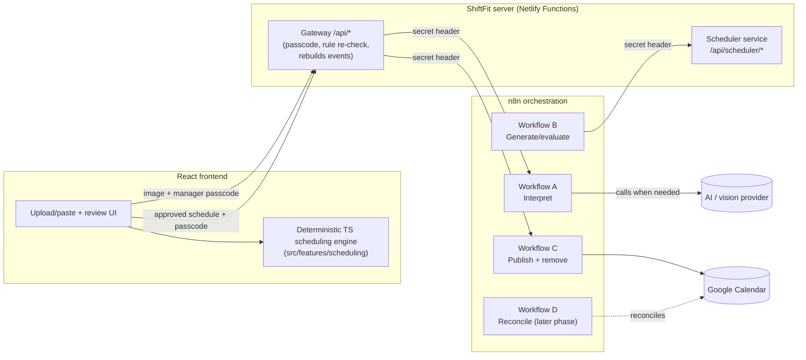

# n8n architecture

ShiftFit's frontend and deterministic scheduling engine work fully standalone
(local text parsing, manual scheduling, auto-fill, local persistence). n8n is
an **optional orchestration layer** for three things the frontend
intentionally does not do itself: calling a real AI/vision provider, talking
to Google Calendar, and coordinating retries/approvals across those external
systems. Nothing here is required to run or demo the app — every webhook has
a local fallback (see `src/services/automation/mockAutomationClient.ts` and
`src/features/import/schedule-extractor.ts`).

## Responsibility split


```mermaid
flowchart LR
  subgraph Frontend["React frontend"]
    UI[Upload/paste + review UI]
    Scheduler["Deterministic TS scheduling engine\n(src/features/scheduling)"]
  end
  subgraph Server["ShiftFit server (Netlify Functions)"]
    GW["Gateway /api/*\n(passcode, rule re-check,\nrebuilds events)"]
    SVC["Scheduler service\n/api/scheduler/*"]
  end
  subgraph N8N["n8n orchestration"]
    A["Workflow A\nInterpret"]
    B["Workflow B\nGenerate/evaluate"]
    C["Workflow C\nPublish + remove"]
    D["Workflow D\nReconcile (later phase)"]
  end
  AI[("AI / vision provider")]
  GCal[("Google Calendar")]

  UI -->|image + manager passcode| GW
  UI -->|approved schedule + passcode| GW
  GW -->|secret header| A
  GW -->|secret header| C
  A -->|calls when needed| AI
  UI --> Scheduler
  B -->|secret header| SVC
  C --> GCal
  D -.reconciles.-> GCal
```

**The browser never calls n8n.** Every request goes through the gateway
([`src/server/gateway.ts`](../src/server/gateway.ts)), described next.

> **Current status (2026-09-30): no server is running.** The team deploys the website to GitHub Pages only,
> which can't run servers, so the gateway and scheduler service are built and tested but not hosted. The
> website works fully without them (Google Calendar in practice-run mode). The "Netlify" instructions below
> apply whenever a host is chosen; the server code itself is host-neutral.

## The gateway (built)

`netlify/functions/gateway.ts` answers these addresses on the same website as the app. All are `POST` and need
`Authorization: Bearer <manager passcode>`:

| Address | What it does |
| --- | --- |
| `/api/session` | Says whether the passcode is right (used by the sign-in box). |
| `/api/publish` | Takes the schedule (students without photos or pasted text, shifts, settings, semester) plus the `approvedVersion` the manager approved. Re-checks it with the strict validator and **every scheduling rule** (`evaluateSchedule`), refuses with `409` if it changed since approval, **rebuilds the events itself** with `buildPublishRequest`, sends them to Workflow C, checks the reply. |
| `/api/remove` | Takes `{ "shiftIds": [...] }` the manager confirmed and asks Workflow C's remove path to delete them. |
| `/api/interpret` | Passes a screenshot upload (max 5 MB + 64 KB) to Workflow A and checks the reading with `schemas.ts`. |

Security: the passcode is compared in constant time; after 10 wrong tries from one address in 15 minutes that
address gets `429` for the rest of the window (counted in the server's memory, so separate server copies count
separately). It answers `503` until `MANAGER_PASSCODE` (12+ characters), `AUTOMATION_SECRET` (16+) and an
`AUTOMATION_URL` using https (or http on localhost) are all set. Errors are short and never repeat student data.
Tested in `src/test/gateway.test.ts`; the four key protections (passcode check, rule re-check, approval-version
check, lock-out) were each deliberately removed once and the tests caught every one.

**When the website is on GitHub Pages** (a different site from the Netlify gateway), the browser first asks the
gateway "may I call you?" (a CORS preflight). The gateway says yes, and lets the page read its answers, only for
sites listed in `ALLOWED_ORIGINS`; it never answers with a wildcard. CORS is not the login: the passcode is still
required on every request.

In the browser, the passcode is held only in memory for the open tab (`services/automation/managerSession.ts`),
never in localStorage or a cookie, and is forgotten if the server ever answers `401`.

**Hard rule enforced by this architecture:** AI never has authority over
scheduling rules (class overlap, cutoff, lunch, 19-hour cap, max days,
opening-shift requirement). Those live only in
`src/features/scheduling/{availability,scheduler,coverage}.ts`, are unit
tested, and are the only code path allowed to produce a `ShiftBlock`.

## Automation modes

1. **Suggest only** — AI extracts, app shows recommendations, nothing is
   scheduled automatically.
2. **Draft + Review (default / current target)** — AI extracts →
   deterministic scheduler proposes a full draft → manager reviews and
   approves → only then does Workflow C publish to Google Calendar.
3. **Auto-publish (future, opt-in)** — same pipeline, but Workflow C runs
   without a manual approval step when confidence/validation thresholds pass.
   Must be an explicit opt-in setting, visually distinct from Draft + Review,
   and must still fall back to human review on low confidence, hard
   conflicts, or destructive calendar changes. **Not implemented in this
   repository** — no UI toggle exists for it yet.

## Workflow A — Intake / AI extraction

`POST /webhook/shiftfit/interpret`

Called by the gateway's `/api/interpret`, which [`schedule-extractor.ts`](../src/features/import/schedule-extractor.ts)
calls only when `VITE_AUTOMATION_API_URL` is configured, a manager has signed in, **and** an image is
attached. Text-only input is always parsed locally first and never leaves the browser.

Request (multipart form — see `extractSchedule`):

| field | type | notes |
| --- | --- | --- |
| `image` | file | the screenshot, if any |
| `text` | string | pasted/typed text (max 4000 characters), treated as **untrusted data** |
| `requestId` | string | client-generated id, echoed back in the response |

The client only sends an image that is a PNG, JPEG or WebP under 5 MB, uses a 60-second timeout, and sends no cookies. Enforce the same limits again on the server.

Response body is validated client-side against
[`schemas.ts`](../src/features/import/schemas.ts) (`validateExtractedSchedule`)
before anything touches the UI:

```json
{
  "requestId": "uuid",
  "status": "needs_review",
  "confidence": 0.93,
  "meetings": [{ "day": "tue", "start": 480, "end": 555, "source": "class" }],
  "constraints": {
    "latestEnd": 960,
    "lunchStart": 720,
    "needsOpeningShift": true,
    "preference": "morning",
    "daysPerWeek": 3
  },
  "warnings": [],
  "unresolved": []
}
```

Pipeline inside n8n (implement in the workflow, not in this repo):

1. Webhook trigger, authenticate the caller.
2. Enforce request size and MIME type allow-list.
3. Treat `text` and the image as **data, not instructions** to any LLM step.
4. Deterministic parsing first where possible (you can reuse the same regex
   approach as `src/features/scheduling/parser.ts`, ported to your n8n Code
   node, or call a small shared service).
5. Vision/LLM call only for image or genuinely ambiguous text.
6. Validate the model's output against a JSON Schema mirroring
   `schemas.ts` before returning it.
7. Return the shape above. Never return raw model prose as if it were
   structured data.
8. Delete the uploaded image after extraction — do not retain it.

## Workflow B — Generate / evaluate schedule

`POST /webhook/shiftfit/generate`

The frontend already runs the exact same deterministic scheduler locally
(`src/features/scheduling/scheduler.ts`) for instant previews. This webhook
exists for a **server-side re-validation** step before publish, and for
non-browser callers (e.g., a nightly reconciliation job). If you stand this
up, it must call the identical algorithm — port `scheduler.ts` to your
backend runtime, or expose it behind a small Node/edge function and have n8n
call that function. Do not re-implement the rules inside n8n Code nodes; they
will drift from the frontend's copy.

### The scheduler service (built)

The "small function n8n calls" now exists: [`src/server/handler.ts`](../src/server/handler.ts). It is one
function, `handleRequest(Request) -> Response`, that reuses the app's own rule code
(`src/features/scheduling`), so the browser and the server cannot disagree. It is tested in
`src/test/server.test.ts` (in a plain Node environment with no browser) and `src/test/evaluate.test.ts`.
It is wired to Netlify by `netlify/functions/scheduler.ts` at `/api/scheduler/*` and stays switched off until
`SCHEDULER_SECRET` is set; see "Switching it on" below.

| Endpoint | Login | What it does |
| --- | --- | --- |
| `GET /health` | none | `{ "status": "ok" }`. Returns no data. |
| `POST /evaluate` | yes | Re-checks a schedule with every rule and reports coverage. Use this to re-validate before publishing. |
| `POST /generate` | yes | Runs the same auto-fill as the app and returns the result, checked with the same report. |

Request body for both (the same shapes as `src/features/scheduling/types.ts`; unknown fields are ignored and every
field is validated with the strict backup-file validator):

```json
{ "students": [ ... ], "assignments": [ ... ], "settings": { ... }, "semester": null, "replaceAutoFilled": false }
```

(`assignments`, `semester` and `replaceAutoFilled` are optional; `replaceAutoFilled` only applies to `/generate`.)

`/evaluate` returns `{ "evaluation": { ... }, "notes": [] }`. `/generate` returns `assignments`, `unmet`,
`openingShiftUnmet`, `explanations`, `deterministic: true`, the same `evaluation`, and `notes`. The
`evaluation` (built by `evaluateSchedule` in `src/features/scheduling/evaluate.ts`) is:

| Field | Meaning |
| --- | --- |
| `ok` | `true` when no rule is broken. Do not publish a schedule that is not `ok`. |
| `scheduleVersion` | The same fingerprint the app sends when publishing, so "did it change since approval?" is a comparison. |
| `blockingIssues` / `overriddenWarnings` | Rules broken now / limits the manager knowingly passed. |
| `coverage`, `gaps` | The two labeled coverage numbers and the understaffed stretches. |
| `uncoveredStaffHours` | Total person-hours still missing. 2 people needed and 1 working for an hour is 1 missing hour. |
| `openingShiftMissing` | Students who need a real opening shift and lack one. |
| `students` | Each student's hours and whether they reached the weekly target. |

Errors are short JSON (`{ "error": "...", "message": "..." }`) with these codes: `401` wrong or missing password,
`503` not configured, `413` body too large, `400` not valid JSON, `422` the schedule failed validation (with a
generic list of problems), `404`/`405` wrong address or method, `500` unexpected. **Errors never contain anything the caller
sent, and student data is never logged.**

**Security model.** Every data endpoint needs `Authorization: Bearer <secret>`. The secret is compared in constant
time. If no secret is configured, or it is shorter than 16 characters, the service answers `503` to everything (it
"fails closed"). Nothing is stored, and every response is marked `Cache-Control: no-store`. It does no rate limiting
of its own: its secret is long and random (not typed by people), and only n8n calls it.

### Switching it on

1. The Netlify function already exists (`netlify/functions/scheduler.ts`), so it deploys with the site.
2. Create a long random secret (32+ characters) and store it as the Netlify environment variable
   `SCHEDULER_SECRET`. Never put it in the repo or in a `VITE_*` variable.
3. In n8n, create a **Header Auth** credential named `Authorization` with the value `Bearer <that secret>`, and
   point the "Call deterministic scheduler service" node in `n8n/shiftfit-generate.json` at
   `https://<your-site>/api/scheduler/generate`.
4. Check it: `GET /api/scheduler/health` should answer `ok`, and `POST /api/scheduler/evaluate` without the header
   should answer `401`.

**Rule re-check before publishing: built, in the gateway.** Instead of n8n calling `/evaluate`, the gateway runs the
same `evaluateSchedule` itself before anything reaches n8n, so the schedule only travels browser -> our own server.
n8n still receives only the events (names and times), as before.

## Workflow C — Human approval / publish to Google Calendar

`POST /webhook/shiftfit/publish`

Called only by the gateway's `/api/publish`, with the request the gateway rebuilt using
[`contracts.ts`](../src/services/automation/contracts.ts)'s `buildPublishRequest`. The browser side is
[`n8nClient.ts`](../src/services/automation/n8nClient.ts) (`getAutomationClient().publishSchedule(...)`), and the
UI is the **Save & share** dialog (`SaveShareDialog.tsx`, section "Send to Google Calendar"):

- a manager must sign in with the passcode first;
- the manager must press "Approve and send" and confirm a dialog that says how many events
  for how many students will be created or updated;
- publishing is **refused while the schedule breaks a rule**, in the UI and again by the gateway;
- publishing never deletes anything. Old events (see below) are removed only after a separate confirmation.

Request. Events are one per **contiguous shift** (adjacent half-hours are merged), and
`shiftId` is stable (`<studentId>-<day>-<startMinute>`), so a retry updates instead of
duplicating. `scheduleVersion` is a content fingerprint of who works when
(`scheduleVersion()` in `features/scheduling/blocks.ts`), so the same shifts always get the
same version, whatever their order or ids.

Each event also carries a `recurrence` block — the real first calendar date, timezone and
repeat rule for that weekly shift, computed by `buildPublishRequest` in `contracts.ts` using
the exact same date math as the `.ics` export (`countWeeklyOccurrences` /
`excludedOccurrences` in `features/calendar/ics.ts`), so the two calendar outputs can never
disagree about which date a "Monday" shift lands on. `recurrence` is only present once the
manager has saved semester dates and a timezone in **Save & share** — the "Approve and send" /
"Do a practice run" button stays locked until then, the same way the per-student `.ics`
downloads already were, because a Google Calendar event needs a real date, not just a weekday.

```json
{
  "scheduleVersion": "v6-e95b3dd7",
  "events": [
    {
      "studentId": "s1",
      "studentName": "Troy C.",
      "day": "mon",
      "start": 480,
      "end": 600,
      "shiftId": "s1-mon-480",
      "recurrence": {
        "startIso": "2026-08-24T08:00:00",
        "endIso": "2026-08-24T10:00:00",
        "timeZone": "Pacific/Honolulu",
        "rrule": "FREQ=WEEKLY;COUNT=16",
        "exdates": ["2026-11-23T08:00:00"]
      }
    }
  ]
}
```

Response:

```json
{
  "scheduleVersion": "v6-e95b3dd7",
  "results": [
    { "shiftId": "s1-mon-480", "status": "created", "googleEventId": "abc123" }
  ],
  "staleShiftIds": ["s1-tue-540"]
}
```

`staleShiftIds` lists events this workflow created in an EARLIER publish for shifts that are no longer in the
schedule (moved or removed; moving a shift changes its `shiftId`). They are only reported. The UI then says "N
older events are still on the calendar" with a **Remove old events** button and a confirmation dialog.

### Removing old events

`POST /webhook/shiftfit/remove` with `{ "shiftIds": [...] }`, a second webhook in the **same** workflow file (n8n
keeps workflow static data per workflow, and removal needs the publish path's `shiftId -> googleEventId` records).
It only deletes ids found in those records, so a made-up id deletes nothing. Response:
`{ "results": [{ "shiftId": "...", "status": "removed" | "not_found" | "failed" }] }`. An event Google says is
already gone (404/410) counts as removed. Tested by running the Code nodes in `src/test/automation.test.ts`.

`status` is one of `created | updated | unchanged | failed | dry_run`. The frontend **never
trusts the response**: `validatePublishResponse` rejects anything malformed, and any result for a
shift that was not sent. `summarizePublish` then derives an honest sync state:

| State | When |
| --- | --- |
| Synced | every event reported `created`, `updated` or `unchanged`, none failed or missing |
| Partly synced | some succeeded and some failed **or were never reported** |
| Failed | nothing succeeded |
| Not synced | a practice run (`dry_run`), or nothing to send |

Without `VITE_AUTOMATION_API_URL`, the mock client returns `dry_run` for every event, which the
UI shows as "Practice run finished... Nothing was sent, so this is still 'not synced'". It can
never produce "Synced". If the schedule changes after a publish, the UI says it must be sent
again. The client has a 30-second timeout and sends no cookies or credentials.

Pipeline requirements, and where each one is handled:

1. Re-validate the schedule hasn't changed since approval: **the gateway** (`409` on a different version).
2. Diff proposed events against previously synced ShiftFit-owned events: **n8n** ("Diff vs. previously synced events").
3. Create/update/skip per event; delete only with explicit permission: **n8n**, with deletion on the separate
   remove path the manager confirms.
4. Persist Google event IDs so retries are idempotent (**retrying must never create duplicate calendar
   events**): **n8n** ("Persist sync state").
5. Return per-event status: **n8n**, checked by the gateway and again by the browser.

The Google Calendar nodes still need your calendar id and OAuth credential filled in, and like every file in
`n8n/`, none of this has been run against a live n8n instance; verify it there before trusting it with a real
calendar. See the `notes` field on each node for exactly what to check.

## Workflow D — Reconciliation (later phase)

Scheduled workflow: detect pending/failed syncs, reconcile against Google
Calendar event IDs, retry transient failures, notify the manager when manual
intervention is needed. **Not built** — do not start this until Workflow C is
proven reliable in Draft + Review mode.

## Authentication

Two layers, and neither password ever reaches the browser's code:

1. **Manager -> gateway:** the manager passcode (`MANAGER_PASSCODE` on Netlify), typed into the sign-in box and
   sent as `Authorization: Bearer <passcode>`. This is a shared passcode, not per-person accounts: anyone who knows
   it can publish. It was chosen because it needs no outside login service and stores no new personal data. To
   switch to personal Google sign-in later, only the passcode check in `handleGateway` and `managerSession.ts`
   change.
2. **Gateway -> n8n:** every n8n webhook (`publish`, `remove`, `interpret`, `generate`) is set to **Header Auth**.
   In n8n create one Header Auth credential: Name `Authorization`, Value `Bearer <AUTOMATION_SECRET>` (the same
   value stored on Netlify), and select it on each webhook node.

Anything prefixed `VITE_` is bundled into public JavaScript, so no secret may ever go in one.

## Error / retry behavior

- The frontend treats any non-2xx response or schema-validation failure as a
  failure and surfaces it in the UI (`ImportPanel`'s status text, or the sync
  badge) — it never silently swallows an error into a fake success state.
- Retries are the caller's responsibility today (manual re-click). Workflow
  D is where automated retry/backoff belongs once built.

## Idempotency strategy

Each publish event's `shiftId` is `<studentId>-<day>-<startMinute>` for one contiguous shift (see
`buildPublishRequest` in `services/automation/contracts.ts`), so it is stable across retries and
across auto-filled vs manual shifts. Store `shiftId → googleEventId` in your persistence layer so
re-publishing the same schedule version is a no-op diff, not a duplicate-event generator. Moving a
shift changes its `shiftId` (new start): the new time gets a new event, and the old one is reported
in `staleShiftIds` for the manager to remove.

## Environment variables

| Variable | Where | Purpose |
| --- | --- | --- |
| `VITE_AUTOMATION_API_URL` | frontend (Netlify build setting or `.env`) | Address of the ShiftFit server. Use `/` when the functions run on the same site. Omit to run fully local (mock client, text-only import). Not a secret. |
| `MANAGER_PASSCODE` | Netlify (server only) | The passcode managers type. 12+ characters. |
| `AUTOMATION_URL` | Netlify (server only) | The n8n server's address, https. |
| `AUTOMATION_SECRET` | Netlify (server only) and n8n credential | Password the n8n webhooks require. 16+ random characters. |
| `SCHEDULER_SECRET` | Netlify (server only) and n8n credential | Password for `/api/scheduler/*`. 16+ random characters. |
| `ALLOWED_ORIGINS` | Netlify (server only) | Other websites allowed to call the gateway from a browser, e.g. `https://p00rmans.github.io` when the app is on GitHub Pages. https site addresses only; `*` and paths are ignored. |
| `BASE_PATH` | build (set by the Pages workflow) | The folder the site is served from, `/cadence/` on GitHub Pages. |

No secrets belong in `VITE_*` variables. AI provider keys and Google OAuth secrets live in n8n's own credential
store.

## What's proven vs. assumed

- **Proven** (covered by tests in this repo): the request/response shapes, validation of the
  webhook responses and of AI output, the honest sync states (a practice run can never show
  "Synced"), stable ids and versions, the approval and rule-check gates in the UI **and in the
  gateway**, the gateway's passcode and lock-out, the scheduler service, the whole sign-in -> send ->
  remove-old-events flow in the app (against a pretend server), and the n8n Code nodes' JavaScript
  (run under Vitest with stand-ins for n8n).
- **Assumed** (you must verify when standing up n8n): the n8n workflows running inside real n8n, the
  AI provider call, the Google Calendar node parameter names, and Netlify's handling of the function
  `config.path` settings. The JSON files under `n8n/` have **never been run against a live n8n
  instance**. The interpret template returns an honest "nothing was read" error until you connect
  your own AI provider, rather than pretending to have read a screenshot.
